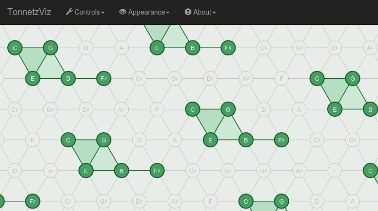

TonnetzViz
==========

TonnetzViz is a web-based music visualizer that receives MIDI input and
visualizes it in real time using the [Tonnetz][1]. It can
also be controlled using the computer keyboard.

[**Try it now!**](https://cifkao.github.io/tonnetz-viz/)

The Tonnetz is a lattice diagram representing tonal space. It can be used to
visualize harmonic relationships in music. Each node in the diagram corresponds
to one of the 12 tones and is connected to 6 adjacent nodes. The 'neighbours'
of each tone are related to it either by a third (major or minor), or by a
perfect fifth, depending on their relative position in the diagram.

Usage
-----
If your browser supports the Web MIDI API, you can use TonnetzViz with any
MIDI-enabled instrument. Just connect it to your computer, go to the Controls
tab in TonnetzViz, select the appropriate MIDI port and play. You can also
connect TonnetzViz to a software sequencer using a virtual loopback MIDI port.

No MIDI support in your browser? Don't have a MIDI keyboard handy? You can use
your computer's keyboard to control the app.

TonnetzViz also has a very simple synthesizer built-in (using the
[Web Audio API][3]). You can turn it on in the Sound tab.

Links
-----
* [Live version](https://cifkao.github.io/tonnetz-viz/)
* [Videos](https://www.youtube.com/playlist?list=PLPdw6Kin7U86ccF4atsm7E9HkWPwFGKvj) on YouTube
* [GitHub repository](https://github.com/cifkao/tonnetz-viz)

[1]: https://en.wikipedia.org/wiki/Tonnetz "Wikipedia article about the Tonnetz"
[2]: https://webaudio.github.io/web-midi-api/ "Web MIDI API"
[3]: https://developer.mozilla.org/en-US/docs/Web/API/Web_Audio_API "Web Audio API"
